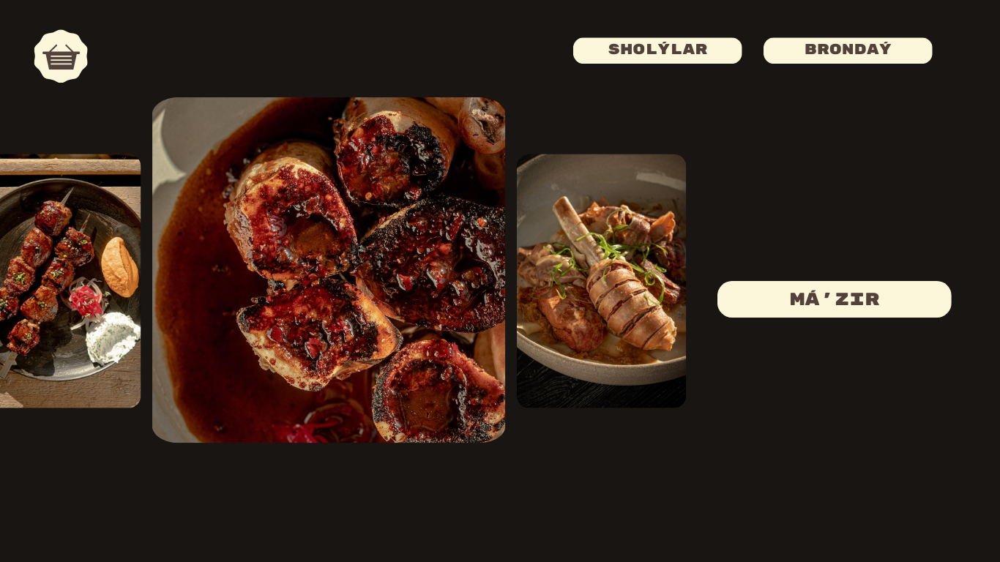
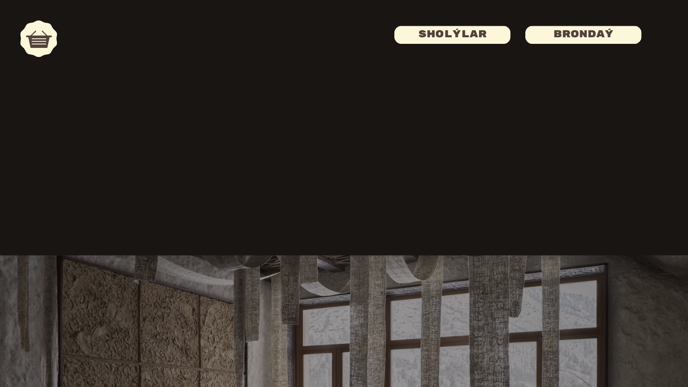

# Online Restaurant WebApp: AUYL

We're using Django for the backend, which manages data, user authentication, and handles requests. For the frontend, we've opted for Angular, creating a dynamic and interactive interface. This setup enables smooth navigation of the restaurant's menu, adding items to the cart, and placing orders online. By combining Django and Angular, we're ensuring an effective solution for managing online orders for the restaurant.


In our web application, customers have the freedom to:
* Explore our diverse menu offerings and effortlessly add their desired items to their virtual cart.
* Customize their selections by adding toppings and extras as desired.
* When ready, they can proceed to finalize their order and place it with us.


Once an order is submitted, the items will be automatically removed from the current cart. The site administrator gains access to the following functionalities:
* View incoming orders through the admin interface and mark them as completed upon fulfillment.
* Modify or update product categories and names as necessary to ensure accurate representation on the menu.


### LOGO 


## Features
```
Certainly! Here's the expanded list with the additional features included:

1. Home: Welcome to our restaurant's website!
2. Menu: Explore the delicious offerings available at our restaurant.
3. Book a Table: Reserve a table for your dining experience.
4. Contact: Reach out to us with any questions or feedback you may have.
5. Gallery: Take a virtual tour and view images of our restaurant.
6. News: Stay updated with the latest announcements, events, and news related to our restaurant.
7. Shopping Cart: Once logged in, users see a representation of the restaurant’s menu, where they can add items (along with toppings or extras, if appropriate) to their virtual “shopping cart.”
8. Placing an Order: Once there is at least one item in a user’s shopping cart, users can place an order.
9. Viewing Orders: Site administrators have access to a page where they can view any orders that have already been placed.
10. And much more: Discover additional features and services available on our website.
```


### Home page  .
 
 
 
 
 


## Tools:
```
1.Angular
2.Django
```


### "Experience the Vibrancy: Join Us at the AUYL Restaurant!"
